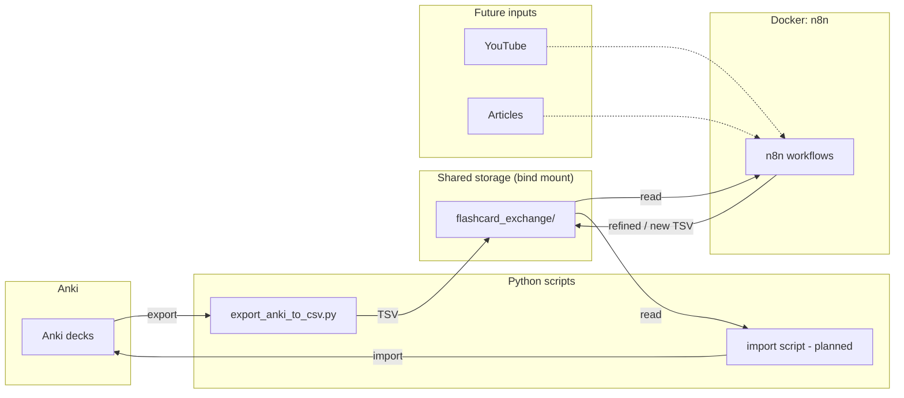

# Flashcard Assistant

A **flashcard assistant pipeline** that connects [Anki](https://apps.ankiweb.net/) with [n8n](https://n8n.io/) (in Docker) so you can export decks, process or refine cards in n8n, and eventually import updated or new cards back into Anki while preserving history. The pipeline is designed to support multiple content sources later (e.g. YouTube transcripts, articles → flashcards).

## High-level structure



- **Anki → Python export** writes all decks to a dated TSV in `flashcard_exchange/`.
- **flashcard_exchange** is the same directory mounted into the n8n container as `/flashcards`.
- **n8n** reads exports, refines flagged cards (or generates new ones), and writes output TSVs to the same mount.
- **Python import** (planned) will read from the mount and sync back into Anki.

---

## n8n Docker

[n8n Docker Docs](https://docs.n8n.io/hosting/installation/docker/)

Run docker compose from the project root so `./flashcard_exchange` resolves correctly.

### Useful commands

- `docker-compose up -d` — Start in background
- `docker-compose down` — Stop and remove container
- `docker-compose logs -f` — View logs
- `docker-compose restart` — Restart the service

Your existing `n8n_data` volume will be reused automatically, so you won't lose any data.

---

## Export Anki to TSV

From the project root:

```bash
uv run python anki/export_anki_to_csv.py
```

- Writes **all decks** to a dated TSV in `flashcard_exchange/` (e.g. `anki_export_2025-01-30T14-30-00.tsv`).
- That directory is the same bind mount n8n uses (`/flashcards` in the container).
- Optional env: `ANKI_PROFILE`, `ANKI_COLLECTION`, `FLASHCARD_EXCHANGE_DIR`.

---

## Reusable utilities (`tsv_parsing`)

- **Paths:** `get_exchange_dir()`, `EXPORT_PREFIX`, `REFINED_PREFIX` — same paths for export and future import.
- **TSV I/O (preferred):** `list_export_tsvs()`, `list_refined_tsvs()`, `read_tsv_rows()`, `write_tsv()` — use these for pipeline files.
- **CSV (legacy):** `list_export_csvs()`, `list_refined_csvs()`, `read_csv_rows()`, `write_csv()` — for reading existing `anki_export_*.csv` only.
